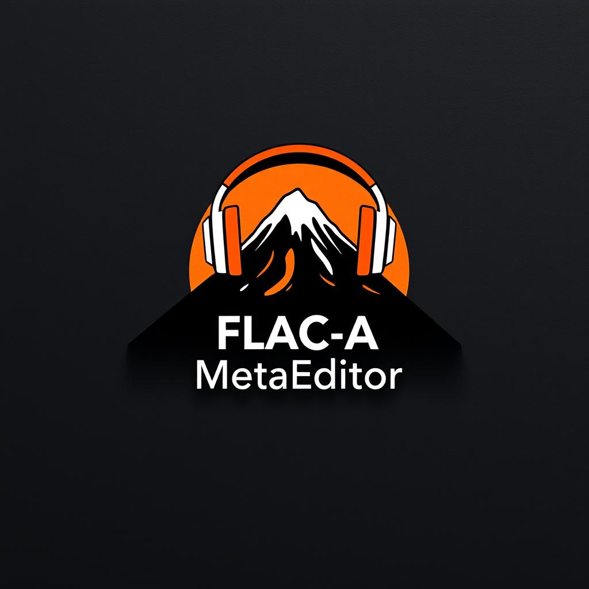
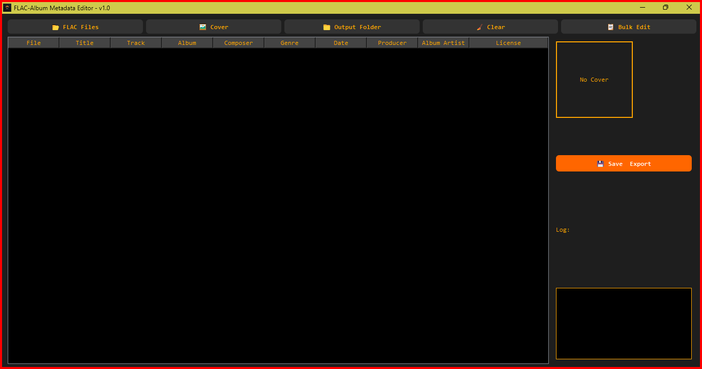

## [Download Here from Google Drive (.exe)](https://drive.google.com/file/d/1daqhMdH8icWZ7V7IhI1cZvARc_lyhK1p/view?usp=sharing)

# FLAC-A Metadata Editor

### FLAC Metadata Batch Editor

**FLAC-A_MetaEditor** is a lightweight and efficient desktop tool for bulk editing metadata in FLAC audio files. Designed with a simple and functional interface, it allows you to manage tags such as title, artist, album, year, and more—all from an intuitive graphical environment.

---

# Screenshot

---

## 🌟 Key Features

- **Batch Metadata Editing:**
  Modify ID3 tags of multiple FLAC files simultaneously.

- **Intuitive Interface:**
  Accessible for all types of users—no advanced technical knowledge required.

- **Clear Data Display:**
  Shows current metadata of each file for easier editing and comparison.

- **Common Field Support:**
  Title, Artist, Album, Year, Genre, Comments, and more.

- **Lightweight and Fast:**
  Optimized to offer a smooth experience, even with large audio libraries.

- **Open Source:**
  Available under the **MIT License**, allowing free modification and redistribution.

---

## 🛠️ How to Use

1. **Open the Application**: Run `FLAC-A_MetaEditor.exe` as administrator to avoid write restrictions.
2. **Select Files**: Load one or more FLAC files from your device.
3. **Edit Metadata**:
   - Modify fields such as title, artist, album, year, etc.
   - Apply changes individually or to all selected files at once.
4. **Save Changes**: Once done, FLAC-A_MetaEditor will overwrite the existing metadata with your new input.

---

## 🎵 Supported Formats

- Only files with the `.flac` extension are supported.

---

## 📊 System Requirements

- **Operating System**: Windows 10 or higher.
- **RAM**: Minimum 2GB.
- **Storage**: Sufficient space to handle selected FLAC files.

---

## 📜 Credits and License

**FLAC-A_MetaEditor** uses the following open-source technologies:

- **[mutagen](https://mutagen.readthedocs.io/en/latest/)** – Library for reading and writing audio file metadata. (GPL License)
- **[Tkinter](https://wiki.python.org/moin/TkInter)** – Standard GUI library for Python.
- **[PyInstaller](https://www.pyinstaller.org/)** – Python application bundler. (GPLv2 or later)
- **[Inno Setup](http://www.jrsoftware.org/isinfo.php)** – Installer creator. (Inno Setup License)

This project is licensed under the **MIT License**. See the [LICENSE](LICENSE.md) file for more details.

---

## 🤝 Contributions

Contributions are welcome! To contribute:

1. **Fork** the repository.
2. **Create a branch** with your improvements or fixes.
3. **Submit a pull request** with a clear description of your changes.

Have suggestions or found a bug? Contact us at [negroayub97@gmail.com](mailto:negroayub97@gmail.com).

---

**FLAC-A_MetaEditor** is your go-to tool for organizing your FLAC music collection quickly, neatly, and professionally. 🎧
